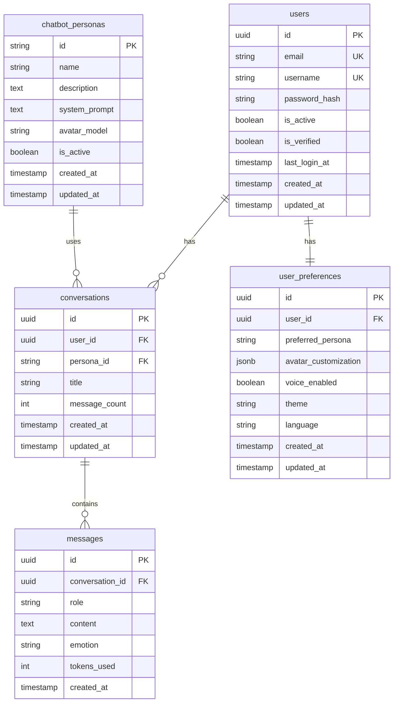

# Entity Relationship Diagram (ERD)

AI Avatar Chat Platform 데이터베이스 ERD입니다.

---

## 📊 텍스트 ERD

```
┌─────────────────────────┐
│       users             │
├─────────────────────────┤
│ PK  id (UUID)           │
│ U   email               │
│ U   username            │
│     password_hash       │
│     is_active           │
│     is_verified         │
│     last_login_at       │
│     created_at          │
│     updated_at          │
└─────────────────────────┘
            │
            │ 1
            │
            ├──────────────────────────┐
            │                          │
            │ N                        │ 1
            ▼                          ▼
┌─────────────────────────┐  ┌─────────────────────────┐
│   conversations         │  │  user_preferences       │
├─────────────────────────┤  ├─────────────────────────┤
│ PK  id (UUID)           │  │ PK  id (UUID)           │
│ FK  user_id             │  │ FK  user_id (UNIQUE)    │
│ FK  persona_id          │  │     preferred_persona   │
│     title               │  │     avatar_custom...    │
│     message_count       │  │     voice_enabled       │
│     created_at          │  │     theme               │
│     updated_at          │  │     language            │
└─────────────────────────┘  │     created_at          │
            │                │     updated_at          │
            │ 1              └─────────────────────────┘
            │
            │ N
            ▼
┌─────────────────────────┐
│      messages           │
├─────────────────────────┤
│ PK  id (UUID)           │
│ FK  conversation_id     │
│     role                │
│     content (TEXT)      │
│     emotion             │
│     tokens_used         │
│     created_at          │
└─────────────────────────┘


┌─────────────────────────┐
│  chatbot_personas       │
├─────────────────────────┤
│ PK  id (VARCHAR)        │
│     name                │
│     description         │
│     system_prompt       │
│     avatar_model        │
│     is_active           │
│     created_at          │
│     updated_at          │
└─────────────────────────┘
            │
            │ 1
            │
            │ N
            ▼
    (conversations.persona_id)
```

---

## 🔗 관계 상세

### 1. users → conversations (1:N)
- **관계**: 한 사용자는 여러 대화를 가질 수 있음
- **FK**: conversations.user_id → users.id
- **CASCADE**: DELETE CASCADE (사용자 삭제 시 대화도 삭제)

### 2. conversations → messages (1:N)
- **관계**: 한 대화는 여러 메시지를 포함
- **FK**: messages.conversation_id → conversations.id
- **CASCADE**: DELETE CASCADE (대화 삭제 시 메시지도 삭제)

### 3. chatbot_personas → conversations (1:N)
- **관계**: 한 페르소나는 여러 대화에서 사용됨
- **FK**: conversations.persona_id → chatbot_personas.id
- **CASCADE**: 페르소나는 삭제 불가 (is_active로 비활성화)

### 4. users → user_preferences (1:1)
- **관계**: 한 사용자는 하나의 설정을 가짐
- **FK**: user_preferences.user_id → users.id (UNIQUE)
- **CASCADE**: DELETE CASCADE

---

## 📐 Cardinality

```
users (1) ──< conversations (N)
conversations (1) ──< messages (N)
chatbot_personas (1) ──< conversations (N)
users (1) ── user_preferences (1)
```

---

## 🎨 Visual ERD (Mermaid)



---

## 🔍 쿼리 패턴

### 자주 사용되는 쿼리

**1. 사용자의 최근 대화 목록**
```sql
SELECT c.*, p.name as persona_name
FROM conversations c
JOIN chatbot_personas p ON c.persona_id = p.id
WHERE c.user_id = ?
ORDER BY c.updated_at DESC
LIMIT 20;
```

**2. 특정 대화의 메시지**
```sql
SELECT *
FROM messages
WHERE conversation_id = ?
ORDER BY created_at ASC;
```

**3. 사용자 통계**
```sql
SELECT 
    u.username,
    COUNT(DISTINCT c.id) as conversation_count,
    COUNT(m.id) as message_count,
    SUM(m.tokens_used) as total_tokens
FROM users u
LEFT JOIN conversations c ON u.id = c.user_id
LEFT JOIN messages m ON c.id = m.conversation_id
WHERE u.id = ?
GROUP BY u.id, u.username;
```

---

**작성일**: 2026-02-09  
**버전**: 1.0
